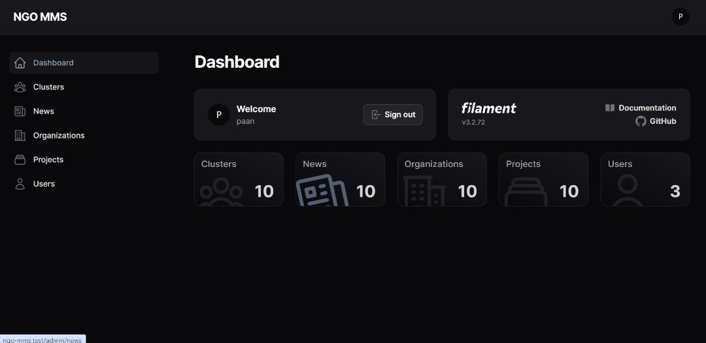
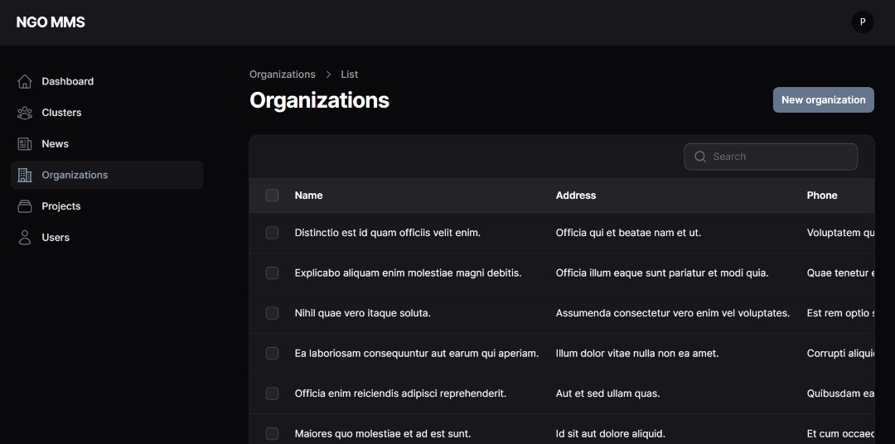

# Welcome to NGO MMS

A proposal for NGO Member Management System.

## Screenshots

[Dashboard](screenshots/dashboard.jpg)
[Organizations](screenshots/organization.jpg)

<p>
    
    
</p>

Generated on: 2024-04-29 01:11:49 (UTC)

## Further installation

Now that you've got your project, it's time to finish up installation. Please make sure to run the following commands
either in your local project or in your deployment tool.

### Run composer install

```
composer install
```

### Create your `.env`

```
cp .env.example .env
```

Now create a new database and enter the credentials inside your environment file.

### Set your app key

```
php artisan key:generate
```

### Upgrade Filament

```
php artisan filament:upgrade
```

### Run migrations

```
php artisan migrate:fresh
```

### Link storage

```
php artisan storage:link
```

### All as one command

```
composer install && 
cp .env.example .env &&
php artisan key:generate && 
php artisan filament:upgrade &&
php artisan migrate:fresh &&
php artisan storage:link
```
